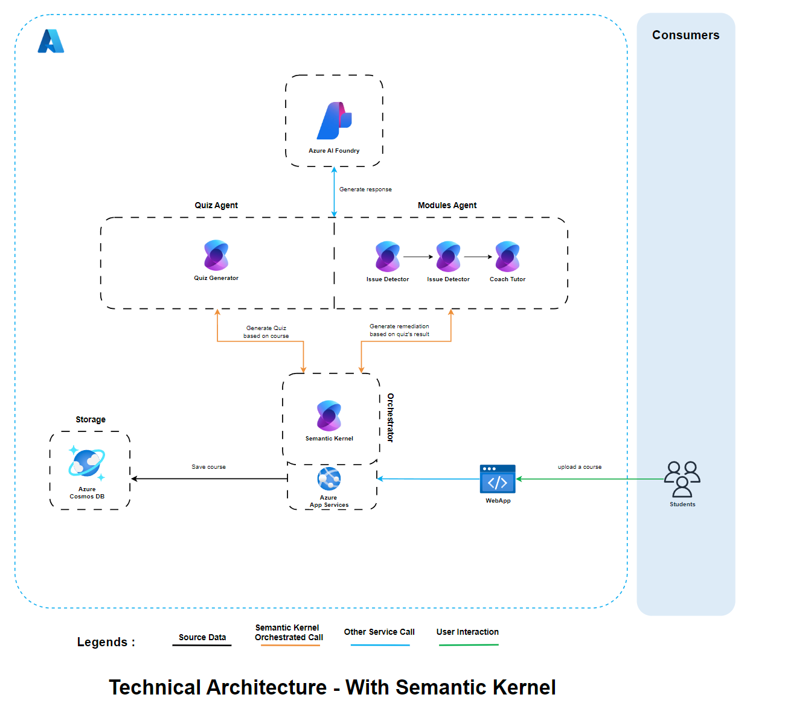

# 📚 Agentic AI Learning Platform – Personalized Education Through Adaptive Quizzing

This project implements an intelligent, multi-agent educational platform designed to help students master any subject by turning their course materials into adaptive quizzes and targeted learning modules. The solution leverages agent orchestration powered by Semantic Kernel and GPT-4.1 (via Azure AI Foundry) to create a fully autonomous and personalized learning loop.

---

## 🎯 Project Goal

Empower students with a seamless, AI-powered learning experience:

- 📥 Upload any course document (PDF)
- 🧪 Automatically generate quizzes from course content
- 📊 Analyze quiz performance to detect learning gaps
- 📚 Generate targeted modules to fill those gaps

This dynamic feedback loop enhances student understanding while minimizing manual intervention.

---

## 🧩 Technical Architecture

**Architecture Diagram**  

---

## 🔗 Core Components

### 🧠 3 Specialized Agents

- **Quiz Generator Agent (GPT-4.1):** Extracts key concepts and formulates relevant questions from the uploaded course.
- **Performance Analyzer Agent (GPT-4.1):** Evaluates quiz results to identify misunderstood concepts and skill gaps.
- **Remediation Agent (GPT-4.1):** Builds custom learning modules and explanations to reinforce weak areas.

### 🤖 Agent Manager

- Orchestrated by **Semantic Kernel**, it coordinates agent interactions, manages context, and ensures learning continuity.

---

## 🖥️ Web Applications

Two apps deployed via **Azure App services & Azure Static Web App**:

- **API Backend (C#):** Handles orchestration logic, document processing, and agent calls.
- **Frontend (React):** Provides a user-friendly interface for uploading documents, taking quizzes, and viewing learning modules.

---

## ☁️ Azure Services Used

- **Azure AI Foundry (GPT-4.1)** – Powering generation and reasoning tasks.
- **Azure CosmosDb** – Stores uploaded content and generated learning modules.

---

## 🔁 End-to-End Flow

1. **Student uploads** a course file.
2. **Quiz Generator Agent** creates a set of questions.
3. Student **takes the quiz** via the React interface.
4. **Performance Analyzer Agent** interprets results.
5. **Remediation Agent** creates tailored modules.
6. Student **reviews custom content** to reinforce learning.

---

## 💡 Why Is This Innovative?

- **Adaptive & Personalized:** Tailors the learning path based on real-time understanding.
- **Fully Automated:** From document to quiz to custom lessons—without manual setup.
- **Agentic Reasoning:** Modular agents with specialized roles, orchestrated via Semantic Kernel.
- **Built for Azure:** Scalable, secure, and cloud-native using modern Azure services.

---

## ⚙️ Key Technologies

- **C#** (Backend API & orchestration logic)
- **React** (Frontend interface)
- **Semantic Kernel** (Agent orchestration)
- **Azure AI Foundry – GPT-4.1** (Multi-role generative intelligence)
- **Azure CosmosDb, Apps Services**
